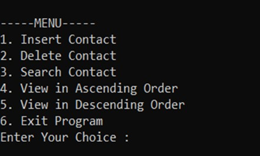
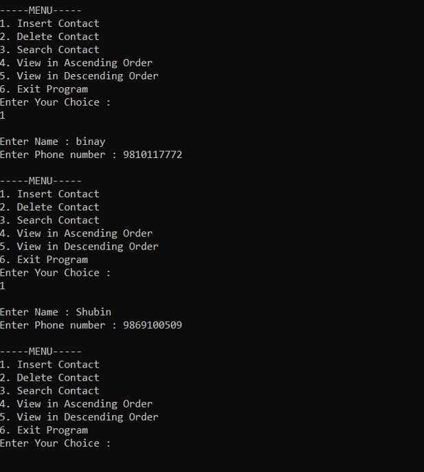
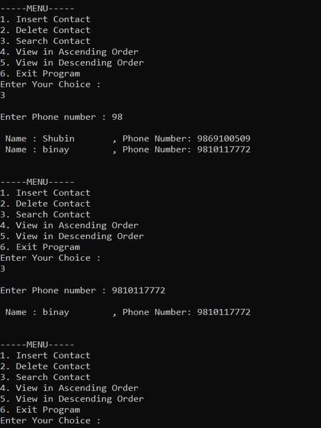
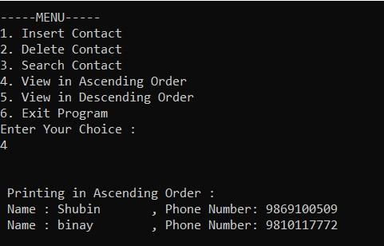
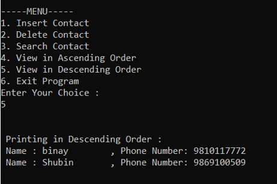
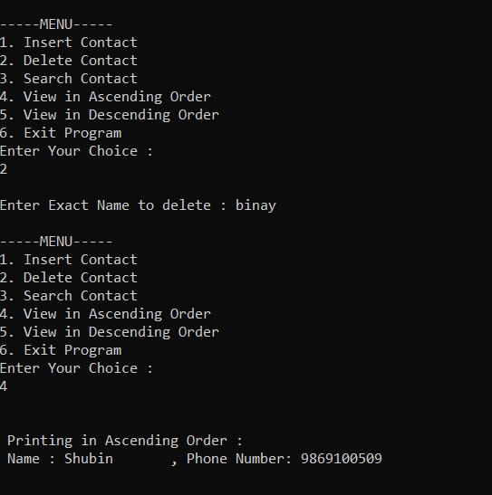
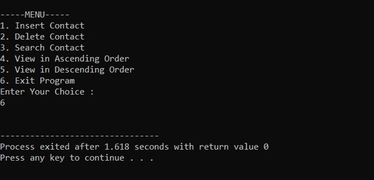

# Binary Search Tree Implementation in C

This repository contains a simple yet fundamental implementation of a **Binary Search Tree (BST)** data structure using the **C programming language**. As part of our Data Structures and Algorithms learning journey, this project focuses on understanding the core principles and operations associated with BSTs.

---

## Key Features

* **Create:** Initializes an empty Binary Search Tree.
* **Insert:** Adds a new node with a given value into the correct position within the BST, maintaining its sorted property.
* **Search:** Efficiently locates a node with a specific value within the BST.
* **Delete:** Removes a node with a given value from the BST while preserving its structure and properties.

---

## 📸 Application Screenshots

| Feature | Screenshot |
|---------|-----------|
| **Landing Page** |  |
| **Insert Function** |  |
| **Search Function** |  |
| **View in Ascending Order** |  |
| **View in Descending Order** |  |
| **Delete Function** |  |
| **Exit Function** |  |

---

## Learnings

* The fundamental concepts of Binary Trees and Binary Search Trees.
* The logic behind the core BST operations: insertion, deletion, and search.
* How to implement these operations using the C programming language.
* The importance of maintaining the BST properties for efficient data retrieval.

---

## Limitations 

* Uses a recursive approach, which might consume more stack space for very large trees.
* Accessing elements can be slightly slower compared to arrays in certain scenarios.
* The BST can become unbalanced or degenerate, leading to increased time complexity in the worst case (O(n)).

---

## Authors

* Shashwat Khadka 
* Shubin Pokhrel 
* Siddhartha Lal Pradhan 
* Binaya Raj Thapa 
* Pranay Kauri 

---

⭐ Star this repository if you find it useful and educational!

